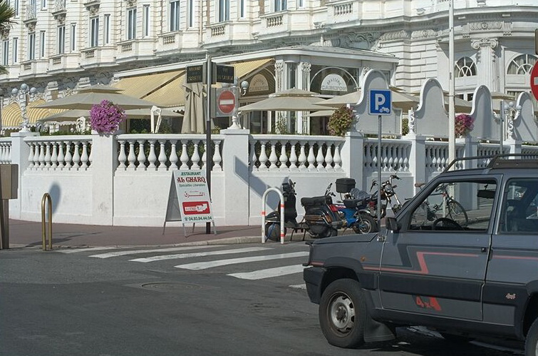
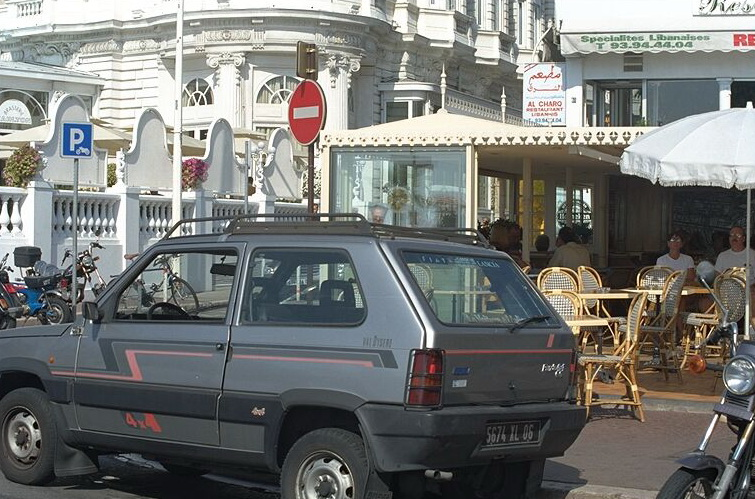
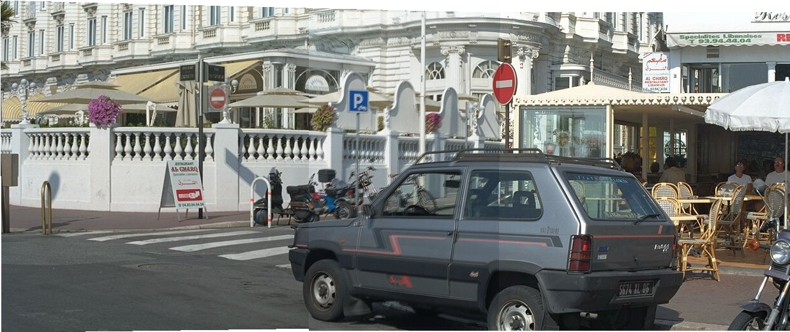

## Panorama

**Panorama** is a little application  construct a panoram from some raw images(support only 2 images for instance )

### Dependence

This project use the libary [Imagine++](http://imagine.enpc.fr/~monasse/Imagine++/) as tool, download and install it to complie the project. Doc expresse is [here](http://imagine.enpc.fr/~monasse/Stereo/quickStartImagine++.pdf). 

### Usage
~~~markdown
$ mkdir build && cd build
$ cmake ..
$ make
$ ./Panorama
~~~

- left click on two images in order to get at least 4 pairs matching points(order of clicking in two image should be the same).
- right click to launch the merge process.

## Result
### Original image

    

### Panorama

